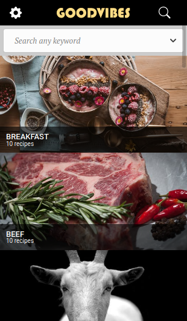

# catalogue_of_recipes
Catalogue of Recipes project.


[![Contributors][contributors-shield]][contributors-url]
[![Forks][forks-shield]][forks-url]
[![Stargazers][stars-shield]][stars-url]
[![Issues][issues-shield]][issues-url]

<!-- PROJECT LOGO -->
  <h3 align="center">Catalogue of recipes</h3>

  <p align="center">
    This project it's a catalogue of recipes. So far the user can choose between diferent categories. when the user choose a category the Website redirect to a list of recipes related the the selected category. <br /></p>

  <p align="center">
    
  &nbsp; &nbsp; &nbsp; &nbsp;
    
  </p>


<!-- ABOUT THE PROJECT -->
## About The Project

This is a real world standard calculator used for series of mathematical operations. It is designed with React, a JavaScript library for building user interfaces.

## Live Demo
It's deployed [here](https://reverent-yonath-202d37.netlify.app) on netlify

### Built With
This project was built using these technologies.
* React
* JavaScript
* GitHub
* Redux
* Eslint
* Stylelint
* VScode
* Jest
* [Themealdb](https://www.themealdb.com/)
* [Pexels](https://www.pexels.com/)


### Getting Started

To get a local copy up and running follow these simple example steps.

### Prerequisites

 * [Node.js](https://nodejs.org/) is required to install dependencies and run scripts via npm.
 * A modern browser

### Clone
* Clone this repo:
  - Clone with SSH:
  ```
    git@github.com:jessicafarias/catalogue_of_recipes.git
  ```
  - Clone with HTTPS
  ```
    https://github.com/jessicafarias/catalogue_of_recipes.git
  ```
  - Clone with GitHub CLI
  ```
    gh repo clone jessicafarias/catalogue_of_recipes
    
 - cd to catalogue_of_recipes


### Setup

Install dependencies:

```
$ npm install
```

Start the local webserver:

```$ npm start``` will open the project at local webserver at http://localhost:3000/ 


## Authors

## 👤 Jessica Michelle Farías Rosado:
 [](https://jessicafarias.github.io/)
 [](https://www.linkedin.com/in/jessica-michelle-farias-rosado/)
 [](mailto:jessica.farias.rosado@gmail.com)
 [](https://twitter.com/FariasRosado)


## 👤 Marc-Antoine Roy
A special thanks is expressed to Marc Roy for the design.This is design will not use as a comercial purpose.
[https://www.behance.net/gallery/11351281/NomNom](https://www.behance.net/gallery/11351281/NomNom)
[Marc-Antoine Roy on Behance](https://www.behance.net/enfantroy)
 


## 🤝 Contributing

Contributions, issues and feature requests are welcome!

Feel free to check the [issues page](https://github.com/jessicafarias/catalogue_of_recipes/issues).

## Show your support

Give a :star: if you like this project!


<!-- MARKDOWN LINKS & IMAGES -->
<!-- https://www.markdownguide.org/basic-syntax/#reference-style-links -->
[contributors-shield]: https://img.shields.io/github/contributors/jessicafarias/catalogue_of_recipes.svg?style=flat-square
[contributors-url]: https://github.com/jessicafarias/catalogue_of_recipes/graphs/contributors
[forks-shield]: https://img.shields.io/github/forks/jessicafarias/catalogue_of_recipes.svg?style=flat-square
[forks-url]: https://github.com/jessicafarias/catalogue_of_recipes/network/members
[stars-shield]: https://img.shields.io/github/stars/jessicafarias/catalogue_of_recipes.svg?style=flat-square
[stars-url]: https://github.com/jessicafarias/catalogue_of_recipes/stargazers
[issues-shield]: https://img.shields.io/github/issues/jessicafarias/catalogue_of_recipes.svg?style=flat-square
[issues-url]: https://github.com/jessicafarias/catalogue_of_recipes/issues

## 📝 License

This project is [MIT](https://opensource.org/licenses/MIT) licensed.